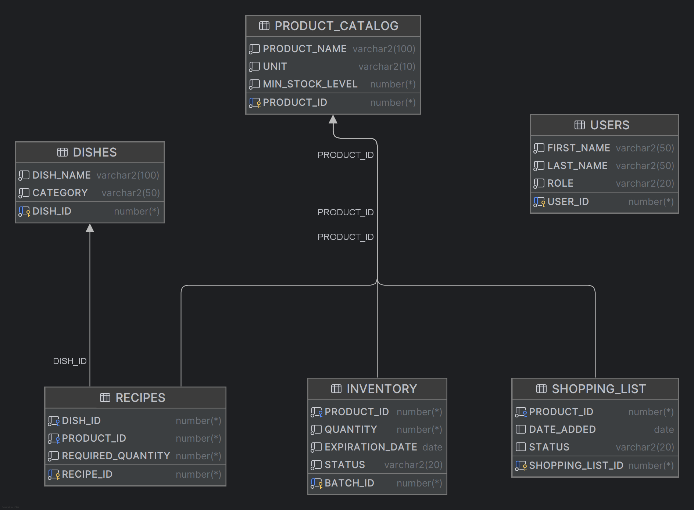

# Projekt - spiżarnia

**Imiona i nazwiska:** Iga Szaflik, Katarzyna Piskorz

## Schemat Bazy danych



### `Users` (Użytkownicy)
Tabela przechowuje informacje o użytkownikach systemu (np. domownikach, kucharzach), którzy mogą modyfikować stany magazynowe lub dokonywać rezerwacji posiłków.

```sql
CREATE TABLE Users (
    User_ID NUMBER GENERATED ALWAYS AS IDENTITY PRIMARY KEY,
    First_Name VARCHAR2(50) NOT NULL,
    Last_Name VARCHAR2(50) NOT NULL,
    Role VARCHAR2(20) NOT NULL
);
```
| Nazwa kolumny | Typ danych | Ograniczenia | Opis |
| :--- | :--- | :--- | :--- |
| **`User_ID`** | `NUMBER` | `PRIMARY KEY`, `IDENTITY` | Unikalny identyfikator użytkownika (Klucz główny, autoinkrementacja). |
| **`First_Name`** | `VARCHAR2(50)` | `NOT NULL` | Imię użytkownika. |
| **`Last_Name`** | `VARCHAR2(50)` | `NOT NULL` | Nazwisko użytkownika. |
| **`Role`** | `VARCHAR2(20)` | `NOT NULL` | Rola w systemie (np. 'ADMIN', 'USER', 'CHEF'). |

### `Product_Catalog` (Katalog Produktów)
Słownik wszystkich produktów, które mogą pojawić się w spiżarni lub w przepisach. Definiuje podstawowe właściwości produktu.
```sql
CREATE TABLE Product_Catalog (
    Product_ID NUMBER GENERATED ALWAYS AS IDENTITY PRIMARY KEY,
    Product_Name VARCHAR2(100) NOT NULL,
    Unit VARCHAR2(10) NOT NULL,
    Min_Stock_Level NUMBER NOT NULL,
);
```
| Nazwa kolumny | Typ danych | Ograniczenia | Opis |
| :--- | :--- | :--- | :--- |
| **`Product_ID`** | `NUMBER` | `PRIMARY KEY`, `IDENTITY` | Unikalny identyfikator produktu. |
| **`Product_Name`** | `VARCHAR2(100)`| `NOT NULL` | Nazwa produktu (np. "Mleko 3,2%", "Mąka pszenna"). |
| **`Unit`** | `VARCHAR2(10)` | `NOT NULL` | Jednostka miary (np. 'kg', 'litr', 'szt'). |
| **`Min_Stock_Level`**| `NUMBER` | `NOT NULL` | Minimalny próg zapasu. Spadek poniżej tej wartości może generować wpis na listę zakupów. |

### `Inventory` (Spiżarnia / Stany Magazynowe)
Tabela przechowuje fizyczne stany magazynowe. Rekordy reprezentują konkretne partie produktów.
```sql
CREATE TABLE Inventory (
    Batch_ID NUMBER GENERATED ALWAYS AS IDENTITY PRIMARY KEY,
    Product_ID NUMBER NOT NULL,
    Quantity NUMBER NOT NULL,
    Expiration_Date DATE NOT NULL,
    Status VARCHAR2(20) NOT NULL,
    FOREIGN KEY (Product_ID) REFERENCES Product_Catalog(Product_ID),
    Reserved_Quantity NUMBER DEFAULT 0 NOT NULL
);
```
| Nazwa kolumny | Typ danych | Ograniczenia | Opis |
| :--- | :--- | :--- | :--- |
| **`Batch_ID`** | `NUMBER` | `PRIMARY KEY`, `IDENTITY` | Unikalny identyfikator partii produktu. |
| **`Product_ID`** | `NUMBER` | `FOREIGN KEY`, `NOT NULL` | Odniesienie do produktu w `Product_Catalog`. |
| **`Quantity`** | `NUMBER` | `NOT NULL` | Aktualna, fizyczna ilość produktu w tej partii. |
| **`Expiration_Date`**| `DATE` | `NOT NULL` | Data ważności danej partii. |
| **`Status`** | `VARCHAR2(20)` | `NOT NULL` | Status partii (np. 'FRESH', 'EXPIRED', 'OPENED'). |
| **`Reserved_Quantity`**|`NUMBER` | `NOT NULL`, `DEFAULT 0`| Ilość produktu z tej partii zarezerwowana na poczet zaplanowanych dań. |

### `Dishes` (Dania w menu)
Słownik dostępnych dań, które można przygotować korzystając z produktów w spiżarni.
```sql
CREATE TABLE Dishes (
    Dish_ID NUMBER GENERATED ALWAYS AS IDENTITY PRIMARY KEY,
    Dish_Name VARCHAR2(100) NOT NULL,
    Category VARCHAR2(50) NOT NULL
);
```
| Nazwa kolumny | Typ danych | Ograniczenia | Opis |
| :--- | :--- | :--- | :--- |
| **`Dish_ID`** | `NUMBER` | `PRIMARY KEY`, `IDENTITY` | Unikalny identyfikator dania. |
| **`Dish_Name`** | `VARCHAR2(100)`| `NOT NULL` | Nazwa dania (np. "Spaghetti Bolognese"). |
| **`Category`** | `VARCHAR2(50)` | `NOT NULL` | Kategoria dania (np. 'ZUPA', 'DANIE GŁÓWNE', 'DESER'). |

### `Recipes` (Przepisy)
Tabela łącząca dania z produktami. Określa listę składników (oraz ich ilości) wymaganych do przygotowania konkretnego dania.
```sql
CREATE TABLE Recipes (
    Recipe_ID NUMBER GENERATED ALWAYS AS IDENTITY PRIMARY KEY,
    Dish_ID NUMBER NOT NULL,
    Product_ID NUMBER NOT NULL,
    Required_Quantity NUMBER NOT NULL,
    FOREIGN KEY (Dish_ID) REFERENCES Dishes(Dish_ID),
    FOREIGN KEY (Product_ID) REFERENCES Product_Catalog(Product_ID)
);
```
| Nazwa kolumny | Typ danych | Ograniczenia | Opis |
| :--- | :--- | :--- | :--- |
| **`Recipe_ID`** | `NUMBER` | `PRIMARY KEY`, `IDENTITY` | Unikalny identyfikator wpisu w przepisie. |
| **`Dish_ID`** | `NUMBER` | `FOREIGN KEY`, `NOT NULL` | Odniesienie do dania w tabeli `Dishes`. |
| **`Product_ID`** | `NUMBER` | `FOREIGN KEY`, `NOT NULL` | Odniesienie do wymaganego produktu (`Product_Catalog`). |
| **`Required_Quantity`**| `NUMBER` | `NOT NULL` | Ilość produktu potrzebna do przygotowania porcji dania. |

### `Shopping_List` (Lista Zakupów)
Rejestr brakujących produktów, które należy dokupić. 
```sql
CREATE TABLE Shopping_List (
    Shopping_List_ID NUMBER GENERATED ALWAYS AS IDENTITY PRIMARY KEY,
    Product_ID NUMBER NOT NULL,
    Date_Added DATE DEFAULT SYSDATE,
    Status VARCHAR2(20) DEFAULT 'TO_BUY',
    FOREIGN KEY (Product_ID) REFERENCES Product_Catalog(Product_ID)
);
```
| Nazwa kolumny | Typ danych | Ograniczenia | Opis |
| :--- | :--- | :--- | :--- |
| **`Shopping_List_ID`**| `NUMBER` | `PRIMARY KEY`, `IDENTITY` | Unikalny identyfikator pozycji na liście. |
| **`Product_ID`** | `NUMBER` | `FOREIGN KEY`, `NOT NULL` | Odniesienie do produktu z katalogu. |
| **`Date_Added`** | `DATE` | `DEFAULT SYSDATE` | Data dodania produktu na listę zakupów. |
| **`Status`** | `VARCHAR2(20)` | `DEFAULT 'TO_BUY'` | Status pozycji (np. 'TO_BUY', 'BOUGHT', 'IGNORED'). |

### `Reservations` (Rezerwacje)
Nagłówek rezerwacji. Pozwala zaplanować przygotowanie konkretnego dania, co wiąże się z alokacją składników w spiżarni.
```sql
CREATE TABLE Reservations (
    Reservation_ID NUMBER GENERATED ALWAYS AS IDENTITY PRIMARY KEY,
    User_ID NUMBER NOT NULL,
    Dish_ID NUMBER,
    Reservation_Date DATE DEFAULT SYSDATE,
    Status VARCHAR2(20) DEFAULT 'ACTIVE',
    FOREIGN KEY (User_ID) REFERENCES Users(User_ID),
    FOREIGN KEY (Dish_ID) REFERENCES Dishes(Dish_ID)
);
```
| Nazwa kolumny | Typ danych | Ograniczenia | Opis |
| :--- | :--- | :--- | :--- |
| **`Reservation_ID`** | `NUMBER` | `PRIMARY KEY`, `IDENTITY` | Unikalny identyfikator rezerwacji. |
| **`User_ID`** | `NUMBER` | `FOREIGN KEY`, `NOT NULL` | Użytkownik dokonujący rezerwacji/planujący posiłek. |
| **`Dish_ID`** | `NUMBER` | `FOREIGN KEY` | Danie, które ma zostać przygotowane. |
| **`Reservation_Date`**| `DATE` | `DEFAULT SYSDATE` | Data utworzenia rezerwacji (lub data planowanego posiłku). |
| **`Status`** | `VARCHAR2(20)` | `DEFAULT 'ACTIVE'` | Status rezerwacji (np. 'ACTIVE', 'COMPLETED', 'CANCELLED'). |

### `Reservation_Items` (Szczegóły Rezerwacji)
Tabela przechowująca szczegóły dotyczące produktów i ich ilości zablokowanych na poczet danej rezerwacji.
```sql
CREATE TABLE Reservation_Items (
    Item_ID NUMBER GENERATED ALWAYS AS IDENTITY PRIMARY KEY,
    Reservation_ID NUMBER NOT NULL,
    Product_ID NUMBER NOT NULL,
    Quantity NUMBER NOT NULL,
    FOREIGN KEY (Reservation_ID) REFERENCES Reservations(Reservation_ID),
    FOREIGN KEY (Product_ID) REFERENCES Product_Catalog(Product_ID)
);
```
| Nazwa kolumny | Typ danych | Ograniczenia | Opis |
| :--- | :--- | :--- | :--- |
| **`Item_ID`** | `NUMBER` | `PRIMARY KEY`, `IDENTITY` | Unikalny identyfikator pozycji rezerwacji. |
| **`Reservation_ID`** | `NUMBER` | `FOREIGN KEY`, `NOT NULL` | Odniesienie do nagłówka rezerwacji w `Reservations`. |
| **`Product_ID`** | `NUMBER` | `FOREIGN KEY`, `NOT NULL` | Rezerwowany produkt. |
| **`Quantity`** | `NUMBER` | `NOT NULL` | Dokładna zablokowana ilość danego produktu. |

### `Inventory_Log` (Historia)
Tabela logów śledząca wszelkie operacje wykonywane na magazynie. 
```sql
CREATE TABLE Inventory_Log (
    Log_ID NUMBER GENERATED ALWAYS AS IDENTITY PRIMARY KEY,
    User_ID NUMBER NOT NULL,
    Product_ID NUMBER NOT NULL,
    Action_Type VARCHAR2(50) NOT NULL,
    Quantity_Change NUMBER NOT NULL,
    Log_Date DATE DEFAULT SYSDATE,
    FOREIGN KEY (User_ID) REFERENCES Users(User_ID),
    FOREIGN KEY (Product_ID) REFERENCES Product_Catalog(Product_ID)
);
```
| Nazwa kolumny | Typ danych | Ograniczenia | Opis |
| :--- | :--- | :--- | :--- |
| **`Log_ID`** | `NUMBER` | `PRIMARY KEY`, `IDENTITY` | Unikalny identyfikator wpisu w logach. |
| **`User_ID`** | `NUMBER` | `FOREIGN KEY`, `NOT NULL` | Użytkownik, który wykonał akcję w spiżarni. |
| **`Product_ID`** | `NUMBER` | `FOREIGN KEY`, `NOT NULL` | Produkt, którego dotyczy zmiana. |
| **`Action_Type`** | `VARCHAR2(50)` | `NOT NULL` | Typ operacji (np. 'ADDED', 'REMOVED', 'SPOILED', 'RESERVED'). |
| **`Quantity_Change`** | `NUMBER` | `NOT NULL` | Wielkość zmiany (+/- ilość dodana lub ujęta). |
| **`Log_Date`** | `DATE` | `DEFAULT SYSDATE` | Dokładny czas wykonania operacji. |

### Zabezpieczenie
Aby system był odporny na błędy i unikał sytuacji niemożliwych w świecie rzeczywistym, zastosowałam ograniczenia typu CHECK CONSTRAINT. Baza danych automatycznie odrzuci każdą próbę wprowadzenia wartości mniejszej niż zero dla ilości produktów oraz rezerwacji.
```sql
-- Zabezpieczenie spiżarni
ALTER TABLE Inventory ADD CONSTRAINT chk_inv_quantity CHECK (Quantity >= 0);
ALTER TABLE Inventory ADD CONSTRAINT chk_inv_reserved CHECK (Reserved_Quantity >= 0);

-- Zabezpieczenie przepisów
ALTER TABLE Recipes ADD CONSTRAINT chk_recipes_req_qty CHECK (Required_Quantity > 0);

-- Zabezpieczenie szczegółów rezerwacji
ALTER TABLE Reservation_Items ADD CONSTRAINT chk_res_items_qty CHECK (Quantity > 0);
```

## Triggery
### Wyzwalacz historii zmian: `TRG_Inventory_History`

```sql
CREATE OR REPLACE TRIGGER TRG_Inventory_History
AFTER INSERT OR UPDATE OR DELETE ON Inventory
FOR EACH ROW
DECLARE
    v_user_id NUMBER := 1;
    v_action VARCHAR2(50);
    v_qty_change NUMBER;
    v_product_id NUMBER;
BEGIN
    IF INSERTING THEN
        v_action := 'ADDED_NEW_BATCH';
        v_qty_change := :NEW.Quantity;
        v_product_id := :NEW.Product_ID;

    ELSIF UPDATING THEN
        v_product_id := :NEW.Product_ID;

        -- zmiana całkowitej ilości
        IF :NEW.Quantity != :OLD.Quantity THEN
            v_action := 'QUANTITY_CHANGED';
            v_qty_change := :NEW.Quantity - :OLD.Quantity;
        -- zmiana zarezerwowanej ilości
        ELSIF :NEW.Reserved_Quantity != :OLD.Reserved_Quantity THEN
            v_action := 'RESERVATION_UPDATED';
            v_qty_change := :NEW.Reserved_Quantity - :OLD.Reserved_Quantity;
        ELSE
            v_action := 'STATUS_UPDATED (' || :NEW.Status || ')';
            v_qty_change := 0;
        END IF;
    ELSIF DELETING THEN
        v_action := 'REMOVED_BATCH';
        v_qty_change := -:OLD.Quantity;
        v_product_id := :OLD.Product_ID;
    END IF;

    INSERT INTO Inventory_log (User_ID, Product_ID, Action_Type, Quantity_Change, Log_Date)
    VALUES (v_user_id, v_product_id, v_action, v_qty_change, SYSDATE);
END;
```

* Zapewnienie pełnej historii operacji magazynowych (kto, kiedy i co zmodyfikował w spiżarni).
* Wyzwalacz reaguje na każdą operację na tabeli `Inventory`. W zależności od rodzaju operacji, automatycznie oblicza różnicę w stanach magazynowych lub rezerwacjach i zapisuje te dane do tabeli `Inventory_Log` wraz z aktualną datą systemową (`SYSDATE`). 
* Uniemożliwia ręczną zmianę stanów magazynowych "poza plecami" systemu, co jest kluczowe w zarządzaniu kosztami restauracji.

## Procedury
### Procedura rozliczania i zwalniania rezerwacji: `Resolve_Reservation`

```sql
CREATE OR REPLACE PROCEDURE Resolve_Reservation(
    p_reservation_id IN NUMBER,
    p_action IN VARCHAR2
)
IS
    v_status VARCHAR2(20);
    v_qty_to_process NUMBER;
    v_deduct NUMBER;

    -- produkty w rezerwacji
    CURSOR c_items IS
        SELECT Product_ID, Quantity
        FROM Reservation_Items
        WHERE Reservation_ID = p_reservation_id;

    CURSOR c_inventory(p_prod NUMBER) IS
        SELECT Batch_ID, Quantity, Reserved_Quantity
        FROM Inventory
        WHERE Product_ID = p_prod AND Reserved_Quantity > 0
        ORDER BY Expiration_Date ASC
        FOR UPDATE; -- blokowanie

BEGIN
    SELECT Status INTO v_status FROM Reservations WHERE Reservation_id = p_reservation_id;

    IF v_status != 'ACTIVE' THEN
        RAISE_APPLICATION_ERROR(-20001, 'Rezerwacja została już zakończona lub anulowana!');
    END IF;

    FOR item IN c_items LOOP
        v_qty_to_process := item.Quantity;

        FOR inv_batch IN c_inventory(item.Product_ID) LOOP
            EXIT WHEN v_qty_to_process <= 0;

            v_deduct := LEAST(v_qty_to_process, inv_batch.Reserved_Quantity);

            IF p_action = 'COMPLETED' THEN -- ugotowano
                UPDATE Inventory
                SET Quantity = Quantity - v_deduct,
                    Reserved_Quantity = Reserved_Quantity - v_deduct
                WHERE CURRENT OF c_inventory;

            ELSIF p_action = 'CANCELLED' THEN -- anulowano
                UPDATE Inventory
                SET Reserved_Quantity = Reserved_Quantity - v_deduct
                WHERE CURRENT OF c_inventory;
            END IF;

            v_qty_to_process := v_qty_to_process - v_deduct;
        END LOOP;
    END LOOP;

    -- aktualizacja
    UPDATE Reservations
    SET Status = p_action
    WHERE Reservation_ID = p_reservation_id;

    COMMIT; -- zapisujemy

EXCEPTION
    WHEN NO_DATA_FOUND THEN
        RAISE_APPLICATION_ERROR(-20002, 'Nie znaleziono takiej rezerwacji!');
    WHEN OTHERS THEN
        ROLLBACK;
        RAISE;

END;
```

* Przetwarzanie statusu rezerwacji składników po podjęciu decyzji przez kucharza (gotowanie lub anulowanie posiłku).
* Procedura przyjmuje jako parametry identyfikator rezerwacji oraz typ akcji (`COMPLETED` lub `CANCELLED`). 
  * W przypadku **`COMPLETED`** (danie ugotowane) – system zmniejsza fizyczną ilość produktów (`Quantity`) w magazynie oraz zdejmuje rezerwację (`Reserved_Quantity`).
  * W przypadku **`CANCELLED`** (anulowanie) – produkty wracają do puli ogólnodostępnej (zmniejszane jest tylko `Reserved_Quantity`).  
Procedura operuje na kursorach z klauzulą `FOR UPDATE` (blokowanie wierszy na czas transakcji) i zdejmuje produkty według zasady FIFO (z partii o najkrótszej dacie ważności). Całość zabezpieczona jest instrukcjami `COMMIT` i `ROLLBACK`.
* Automatyzuje proces wydań magazynowych i zapobiega powstawaniu błędów (np. ujemnych stanów magazynowych).


## Widoki

### Widok raportujący: `V_Cook_Today`

```sql
CREATE OR REPLACE VIEW V_Cook_Today AS
WITH Available_Stock AS (
    -- dostępną ilość na półce (minus rezerwacje)
    SELECT
        Product_ID,
        SUM(Quantity - Reserved_Quantity) AS Total_Available,
        MIN(Expiration_Date) AS Soonest_Exp_Date
    FROM Inventory
    WHERE Status = 'AVAILABLE'
      AND Expiration_Date >= SYSDATE
    GROUP BY Product_ID
),
     Dish_Capabilities AS (
         -- Łączymy dania z ich przepisami i naszym magazynem
         SELECT
             d.Dish_ID,
             d.Dish_Name,
             d.Category,
             MIN(FLOOR(NVL(st.Total_Available, 0) / r.Required_Quantity)) AS Max_Portions,
             MIN(st.Soonest_Exp_Date) AS Critical_Expiration_Date -- data ważności
         FROM Dishes d
                  JOIN Recipes r ON d.Dish_ID = r.Dish_ID
                  LEFT JOIN Available_Stock st ON r.Product_ID = st.Product_ID
         GROUP BY d.Dish_ID, d.Dish_Name, d.Category
     )

SELECT
    Dish_Name AS "Nazwa Dania",
    Category AS "Kategoria",
    Max_Portions AS "Możliwych Porcji",
    Critical_Expiration_Date AS "Najpilniejszy Składnik"
FROM Dish_Capabilities
WHERE Max_Portions > 0
ORDER BY Critical_Expiration_Date ASC;
```

* Dynamiczne wspieranie decyzji Szefa Kuchni i kucharzy poprzez odpowiedź na pytanie: *"Co możemy w tym momencie ugotować z wolnych składników?"*.
* Widok jest złożonym zapytaniem analitycznym, które wykorzystuje podzapytania (klauzula `WITH`), złączenia wielotabelowe (`JOIN`), funkcje agregujące (`SUM`, `MIN`) oraz funkcję matematyczną `FLOOR`. 
  Zapytanie wylicza realną ilość dostępnych produktów (fizyczny stan minus rezerwacje innych kucharzy), zestawia je z wymaganiami z przepisów (`Recipes`) i oblicza maksymalną liczbę pełnych porcji, jaką można przygotować. Wyniki są filtrowane (tylko dania, na które starczy składników) i sortowane według **daty ważności najpilniejszego składnika** (promowanie dań z produktów, które psują się najszybciej).
* Kluczowe narzędzie w strategii *Zero Waste* – pozwala kucharzowi szybko podjąć decyzję o przygotowaniu dań ze składników, które w przeciwnym razie musiałyby zostać wyrzucone lub oddane.